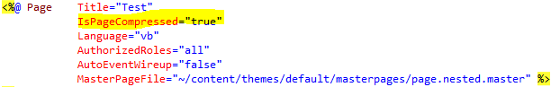
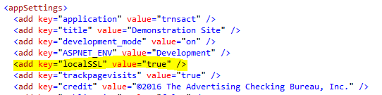
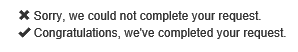

  

### *Documentation for the trnsACT Framework*

## trnsACT 1.6.0 Version Notes

### Bug Fix: Email Template

There was a bug found in in the method that determined which email template is to be used for HTML email. The expected behavior was to check for the existence of the template in the templates folder of the current theme, with the failover using the template in the default theme. The bug meant that the current theme location was not evaluated. Instead, only the default theme templates were used. This has been corrected.

### Errors when Emailing

Formerly, if there was an error sending emails the email was not logged. This has been changed so that in the event of an environment error (our SMTP server at Office 365 going down, for example) then the email is logged anyway. The prefix “Error:” is added to the internal description so that error emails can be identified.

### The (not so) Humble Textbox

Although we spend a great amount of time coding HTML forms there is a range of options for us to use for the textbox. Look at these controls:

 

Did you notice that the first option is a server tag has been added to a regular HTML control? This is how the markup is rendered:

 

 For all three textboxes you can both set and retrieve values from code:

  

But the property name is different. Use [Value] for the input control and use [Text] for the textbox controls.

And new for trnsACT 1.6.0 are some added features to make the NetTextBox control more HTML5-friendly. If you want to set the value in code but you’ll be consuming the entered value client-side – say via an jquery ajax call—it might be better not to have that “ctl00$ctl00$masterContent$pageContent$” prefix in the name. On the trnsACT control set the EnableWireup property to “false.” 

  

This renders markup that is friendly to client-side scripting. 

  

If you do a postback, the fact that your control is not wired up means some extra steps. This postback code: 

  

Renders this output:

  

Notice that to you’ll need to use the request object to get the value of the trnsACT control with EnableWireup=”false.” Also, there’s no session state to hold on to the control value so you’ll need to reset it yourself. So, this is great for pages with heavy client-side handling but troublesome for pages with resubmit logic on the server side.

The new trnsACT textbox also includes some other properties, including a placeholder (with translation built in) and an IsRequired property that adds the required attribute for browsers supporting HTML5. These controls

  

Are rendered: 

  

If you like the trnsACT textbox, you can use tag mapping to automatically use the trnsACT version whenever you use the 

    <asp:TextBox tab. In the web.config file, add the tabMapping reference to the configuration/system.web/pages node, as shown here.

  

It’s convenient but unfortunately the Visual Studio Intellisense for the trnsACT control properties don’t transfer with the mapping.

### Automatic page compression

Page compression has arrived as a trnsACT feature. Some older IIS versions struggle to enable built-in .NET compression of served pages for browsers that identify in request headers that they support either deflate or gzip, so this had been impractical to implement in the past. The number of newer servers has enabled a re-think.

The .NET page compression may not work for every server so you MUST test this feature on all environments: development, test and production. If it works, it can compress our usual start pages by up to 1/6 of their normal file size. So the possible performance gain can be sizable. But...

WARNING: Your mileage may vary. Some developers have identified issues when nested controls are compressed. Others have found Sessionstate can become unreliable when compressing pages. In my testing I haven’t discovered those issues, but again I say, test. 

The default is to not compress pages. So if you want to turn it on and test, just update the compresspages app setting to “true”. It’s that simple to turn on and off.

    <add key="compresspages" value="true"/> 

Alternatively, for web forms that inherit from trnsACT’s Page object (and why wouldn’t you?) then you can set compression per page. 

  

### Changes in NetImage Control

The trnsACT NteImage control inherits from the asp.net image control which output html that HTML Standards validators identify as non-compliant. The transact version now automatically drops the “px” units indicator from the values of the width and height attributes. We sometimes use the ImageAlign base property:

    <trnsACT:NetImage
        ID="LogoImage"
        ImageAlign="Top"
        ImageUrl="logo.png"
        Height="65"
        Width="158" 
        AlternateText="{CONTENT:website_title} Logo"
        ClientIDMode="Static"
        runat="server" />

The problem is that the control outputs the ImageAlign property as the “align” HTML and it is no longer considered standard. The trnsACT contral has been changed to render an inline style attribute instead:

    ImageAlign.AbsBottom: 	style="vertical-align: bottom;" 
    ImageAlign.AbsMiddle: 	style="vertical-align: middle;"
    ImageAlign.Bottom: 	style="vertical-align: bottom;"
    ImageAlign.Left: 	style="float: left;"
    ImageAlign.Middle: 	style="vertical-align: middle;"
    ImageAlign.Right:  	style="vertical-align: right;"
    ImageAlign.TextTop:  	style="vertical-align: text-top;"
    ImageAlign.Top:  	style="vertical-align: top;"

If you don’t want this output, do not use the ImageAlign property.

### Running with a Self-Signed SSL Certificate on Local

Normally if trnsACT identifies that you are running against localhost, ForceToSSL is ignored. But if you have taken the time/effort to install a developer certificate, you can configure trnsACT to run secure locally.

  

### New Custom Extensions

Some of these are from my personal toolkit of methods/snippits that I’ve used for years, and I’m sharing them as time-saving trnsACT extensions.

1.	IsNotNullIOrEmpty

   

2.	Prepend
    
    `"parameter1=value1&parameter2=value2".Prepend("?") =  "?parameter1=value1&parameter2=value2”
`
3.	NotEquals – The reverse test of the built-in Equals extension

4.	AddTimeStamp: Adds a timestamp to file name string

    `This Response.Write("myfile.aspx".AddTimeStamp) renders as myfile_20160319021354.aspx`

5.	ToDate – Converts a datestring to a Date type.
6.	ConcatString – Appends one string to another
7.	String format validators. Using the Microsoft-suggested RegEX patterns the formats of strings can be evaluated with these extensions:
    * IsEmail
    * IsName
    * IsURL
    * IsUSPostalCode
    * IsUKPostalCode
    * IsCanadianPostalCode
    * IsPostalCode (US or Canadian)
    * IsUSPhoneNumber
    * IsUSTaxpayerID

### Bootstrap Icons

I use these in the built-in handlers and now you can too. 
This 

    Response.Write(String.Format("{0} {1}", trnsACT.Web.Utilities.FailureIcon, "Sorry, we could not complete your request.").AddWebBreak)
    
    Response.Write(String.Format("{0} {1}", trnsACT.Web.Utilities.SuccessIcon, "Congratulations, we've completed your request.").AddWebBreak)

Renders this:

   

### UserID Added to Custom Authentication Ticket

Zack discovered on Toyota that when using the email address as a username, it’s not permanent. The UserID, a GUID in membership, is unique and permanent, but can be difficult to access. The version of trnsACT adds the UserID as part of the authentication ticket and is always accessible without an additional database call.

[Home](../README.md) \| [Release Notes](releasenotes.md)