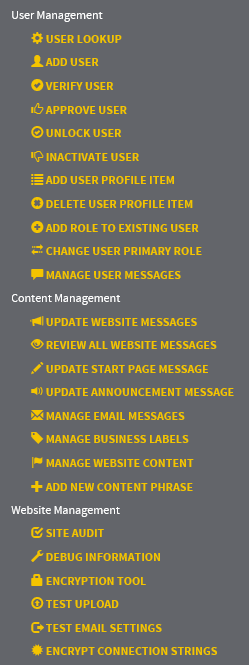

  

### *Documentation for the trnsACT Framework*

## trnsACT 1.2.0 Version Notes

### Bug Fix

One issue regards the business database catalog. The trnsACT logic calls for the database in the account.config file to be used first, and then if needed the catalog in the business provider of the web.config. This is important because on some sites,  different accounts may use different databases. But an error in the trnsACT code meant that for certain use cases, the accounts.config value was not being fetched properly. This error has been corrected. 

### NetLink Control Enhancement

Added the optional filters to the trnsACT:HyperLink (aka trnsACT:NetLink) to allow hyperlinks to be shown based upon criteria for theme, account, culture and role. This is the same filtering for the powerful trnsACT NetPanel. Example:

    <trnsACT:Hyperlink ID="hlContactUs" Roles="developer,helpdesk" Cultures="fr" Accounts="569701" Themes="akron" runat="server" NavigateUrl="~/site/contact.aspx" />

### Caching DataViews Fetched from the Data.GetData Method

For the Data.GetData member, there is any added parameter that will allow the dataview objects to be cached for a specified number of minutes. This is helpful if the same dataview is been rendering often. This means that the object is stored in the application server memory instead of being fetched from the database. This will help performance as long as it is not overused. 

### Additional Methods Added to the trnsACT Management Handers

Additional management tasks/function have been added to the trnsACT Management handlers to allow management of the website, content and memberbership. 

 

[Home](../README.md) | [Release Notes](releasenotes.md)