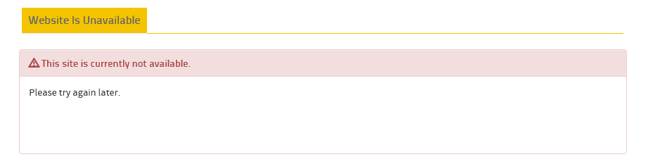
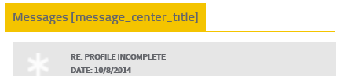
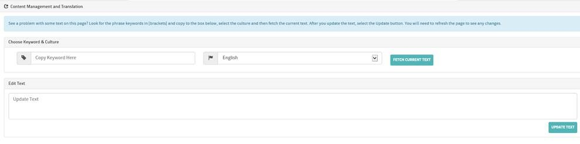
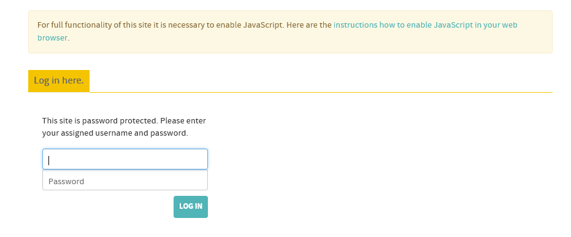
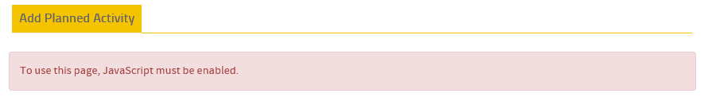
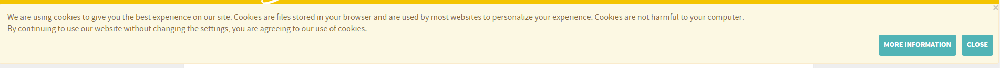

  

### *Documentation for the trnsACT Framework*

## trnsACT 1.3.0 Version Notes

### DisplayFilters Added to User Control Base Class

The parent object for user controls now supports display filters so that controls will render at runtime based upon control attributes. 

For example, this user control is only shown to users with a developer role with a current theme of “ohio”: 

    <WebPart:resources ID="Resources" AuthorizedRoles="developer" SupportedThemes="ohio"  runat="server" /> 

### Bug Fix: Unavailable Page

For some sites, the automatic link to the unavailable error page was broken. Now, for all sites if you update the “status” app setting in web.config from “up” to “down”, users will be redirected to this customizable error page. This is yet another way to “bring down a site gracefully.”

### Optimization: Communication.Content Class

Optimization of the communication.content class  and the forms authentication routines has meant a noticeable performance boost for some sites. “Your mileage may vary.”

### Special Use Case: On-Page Translations with the translator Subrole

A new secondary role of translator, and an associated user control, allows translators to update text on-screen. Translators see the content phrase keyword in brackets.

 

 The text/translation of that keyword (message_center_title in this example) can then be updated using a form at the bottom of the page. The changes will take effect after a page refresh. This means that knowledge workers can keep tweaking the text until it’s “très magnifique.” This functionality will allow us to manage content/translations without xml and Excel files.

 

 ### JavascriptDisabled Subrole

 

 The default process login handler adds a subrole of javascriptdisabled for authenticated users with javascript disabled in the browser.

 

## Support for Cookies Notice Required by EU

European Union law requires that websites post a notice about of the use of cookies upon a user’s first visit. Many international companies – including some of our clients—have made this an enterprise-wide practice that affects North American sites as well. trnsACT make this easy with an enhanced (highly configurable) cookies message:

 

[Home](../README.md) | [Release Notes](releasenotes.md)