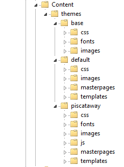

  

### *Documentation for the trnsACT Framework*

## trnsACT 1.4.0 Version Notes

### Change to Recommended Folder Structure

The later versions of Visual Studio (2013/2015) offer a new folder structure for webform projects and trnsACT 1.4 accommodates (but doesn’t require) those changes. Microsoft’s folder changes were made for good reasons, that is, to better integrate NuGet packages and to facilitate linked file bundling. But these changes also fulfill a long-time design goal for trnsACT, to have all theme assets stored together. 

Currently, for a given theme called myTheme we would have themed templates (master pages and skins) in the ~/app_templates/myTheme folder and other assets like css, javascript, font and image files in the ~/app_themes/myTheme folder. This is because ASP.NET prevents storing masterpages in the app_themes folder. The new trnsACT supports the new VS structure where all the theme components are conjoined into a single folder under the ~/Content/themes folder:
 

The notion of a base theme is new for Visual Studio and is intended to contain third party assets like jquery, jquery-ui and bootstrap that will be updated by NuGet or manually. The base assets are not intended to be customized. If you create a theme-specific version of bootstrap.css,  for example, that would be added to the css folder of the theme where trnsACT would automatically use it instead of the base version. I have customized the Microsoft structure to add folders for (HTML email) templates and masterpages. At long last a single theme folder can be used to “drop and play.” 

### Bug Fix: trnsACT.Web.Utilities.ApplicationName

Corrected a bug with the trnsACT.Web.Utilities.ApplicationName and trnsACT.Web.Utilities.AccountReference fields. The returned values for these readonly properties were reversed.”

### Bug Fix: IsInRole

Corrected a bug with the IsInRole function in the base page and base usercontrol classes. This is a nifty little helper-- 

 

### Persistent Cookies

4.	A longstanding trnsACT issue is that after a user logs out of the site, her accountreference and websitetheme returns to “0000” and “default”. On sites with a single client this was easily handled by making the client’s theme the theme of the default account “0000.” But on multi-tenant sites this meant that the “logged out” page was forced to be generic. Now during logging out, persistent cookies for accountreference, websitetheme and culture are added with the values from the user’s session. Those cookies are evaluated to get the default  trnsACT.Base.Intrinsics property values that are used in theming and content. This means that if a user signs in as Dunlop and then returns to the site, the Dunlop theme is used for the login page.

### Dubug Information Page Updated

The debug class (used on the debuginfo.aspx page) has been updated to include cookie values and the values of the intrinsics properties.

### IsPageSetToNoCache Page Attribute

Created a Boolean directive/property called IsPageSetToNoCache for the trnsACT base page class. If set to true, this will add headers to instruct the browser not to cache the page locally. Caution: although a browser should, it doesn’t have to follow these header instructions. The Opera browser is notorious for ignoring these instructions. 

### Site.Master Location

The trnsACT theming engine now handles site.master masterpages in the root of the site. This is the preferred location for projects created by Visual Studio.

### Recommendations

Recommendation: drop some unneeded files with functionality that is now handled by the updated .NET framework version of the Friendly URL dll
*	~/app_browsers/Form.browser
*	~/app_code/VBCode/FormRewriter.vb

Recommendation: Class files stored in the app_code folder should be set with Build Action = “Content”

Recommendation: Other class files in the app_code folder that are meant to set with a Build Action = “Compile” should be moved to a folder called “Classes”

### Known Issues

Although trnsACT heavily uses friendly urls (where ~/members/member/somelongbutdesciptivepagenamewithanextension.aspx is shown as ~/ShortName), it currently does not support URL routing (where ~/members/member/claimdetail.aspx?claimnumber=1254 becomes ~/Claim/1254). This feature was initially a .NET 4.0 feature for MVC projects only, but Microsoft has released workarounds for implementing on Webform projects like ours. These workarounds do not work with trnsACT. 

Bundling/minification is another feature for .NET 4.0 MVC that has a Webform workaround. My tests have shown those workarounds to be too slow-- which is strange for a feature that is intended to speed up the page fetch. I am exploring alternate methods of bundling. 

[Home](../README.md) \| [Release Notes](releasenotes.md)