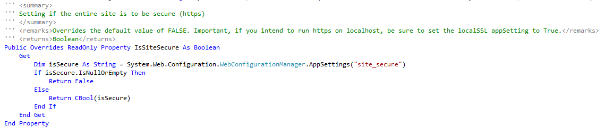

  

### *Documentation for the trnsACT Framework*

## trnsACT 1.6.1 Version Notes

### Running the Entire Site with Secure Schema

When using the processlogin.ashx handler that inherits from trnsACT.Web.Handlers.ProcessLogin there is a simple way to force the entire site to be run under port 443 (https): set the readonly property IsSiteSecure to true. Better yet, define and reference an application setting (I use “site_secure”) in the web.config file. 

 

[Home](../README.md) \| [Release Notes](releasenotes.md)