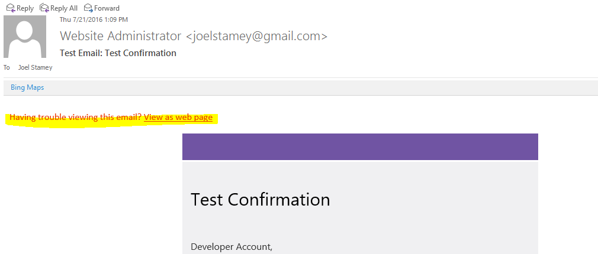
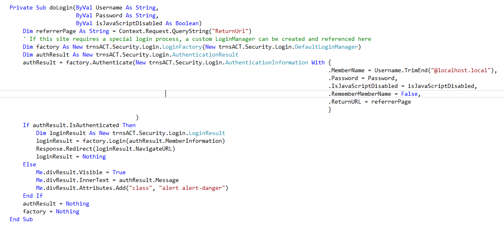

  

### *Documentation for the trnsACT Framework*

## trnsACT 1.6.2 Version Notes

### Bug Squashed: Email Log Id in HTML Template

One of the standard features in our email communication is the “Having trouble” link that provides a link to the message on the webserver. The link includes the Email Log Id that allows the member’s particular message to be retrieved. trnsACT version 1.6 implemented an update to email logging that introduced a bug that caused the email log id to be unavailable at the time the email is being built. This meant that the link in the email did not the email log id value in the query string of the URL. This has been corrected.

 

### More Bugs Squashed: Miscellaneous

A number of trapped errors during startup have been removed, including
* An error when trying to find the Friendly URL for header and divider menu items that do not have links,
* An error in the SQL provider of the Communication.Messages object that arose when referencing a message by the collection index, and
* An error in the XML config file reader when trying to test is a particular item (node) existed in the configuration file.

### The Login Factory

A new alternative code approach to authorizing and authenticating users has been added to make the log in process more streamlined and customizable. The new trnsACT.Security.LoginFactory class supports dependency injection of a LoginManager. You can either use the built-in DefaultLoginManager that includes security best practices (recommended) or create your own Login Manager that either inherits from the trnsACT.Security.Login. LoginManagerBase base class or implements the trnsACT.Security.Login.ILoginManager interface directly. 

 

 This new process was created to streamline the log in process so that custom business logic might be used to write the authentication ticket. The current process writes a generic authentication ticket and then rewrites it in the processlogin handler with custom business logic.

To call the validation, just add a call to the trnsACT shared (static) utility.
 
[Home](../README.md) | [Release Notes](releasenotes.md)