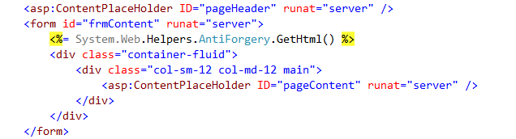
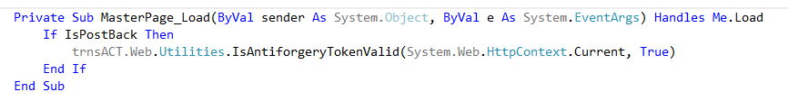

  

### *Documentation for the trnsACT Framework*

## trnsACT 1.6.3 Version Notes

### Javascript Control: Now Ignore Zero-Byte Size Files

In the past, the Javascript control only looked at the existence of files. That meant if the developer did not set the optional view toggle attributes correctly, an empty file would be sent to the user’s browser. That’s not a huge performance but every byte matters.

### New Custom Extension

GetSecureFullPath converts a virtual path to a full url with a secure (https) scheme. The extension evaluates the host (is localhost?) and the “localSSL” app setting (Is “true”?) when formatting the full path.
Use: 
Dim loginPage As String = "~/account/login.aspx".GetSecureFullPath

### Cross-site Scripting Request Forgery

This is one of the cross-site vulnerabilities. A hack can harvest the session form value and try to use it to submit data to the server without the user’s knowledge. The solution is to use to create an encrypted token in a cookie—that the browser stores locally and can’t be accessed by the hacker- and validate it against an encrypted token in a form control.
The mitigation suggested by Microsoft was retrofitted to .NET 4.0 but it was imperfectly implemented. The version that resolved those issues to make the token validation reliable for .NET 4.0 sites. trnsACT 1.6.3 does the heavy lifting but you’ll need to implement it. 
First, look for the <form runat=”server”> tag in your site. They’re usually in the nested master pages but you may find them in specific pages like login.aspx. After the form tag add this Microsoft control that will automatically render the form control and create the cookie. 

 

To call the validation, just add a call to the trnsACT shared (static) utility.
 
 